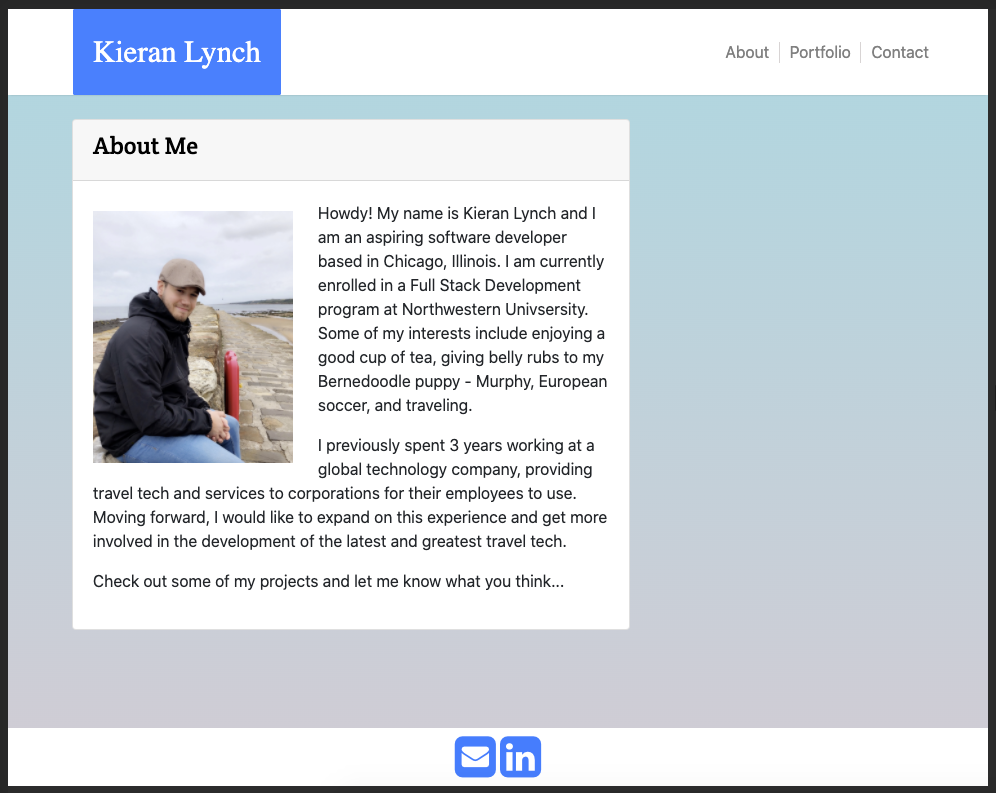
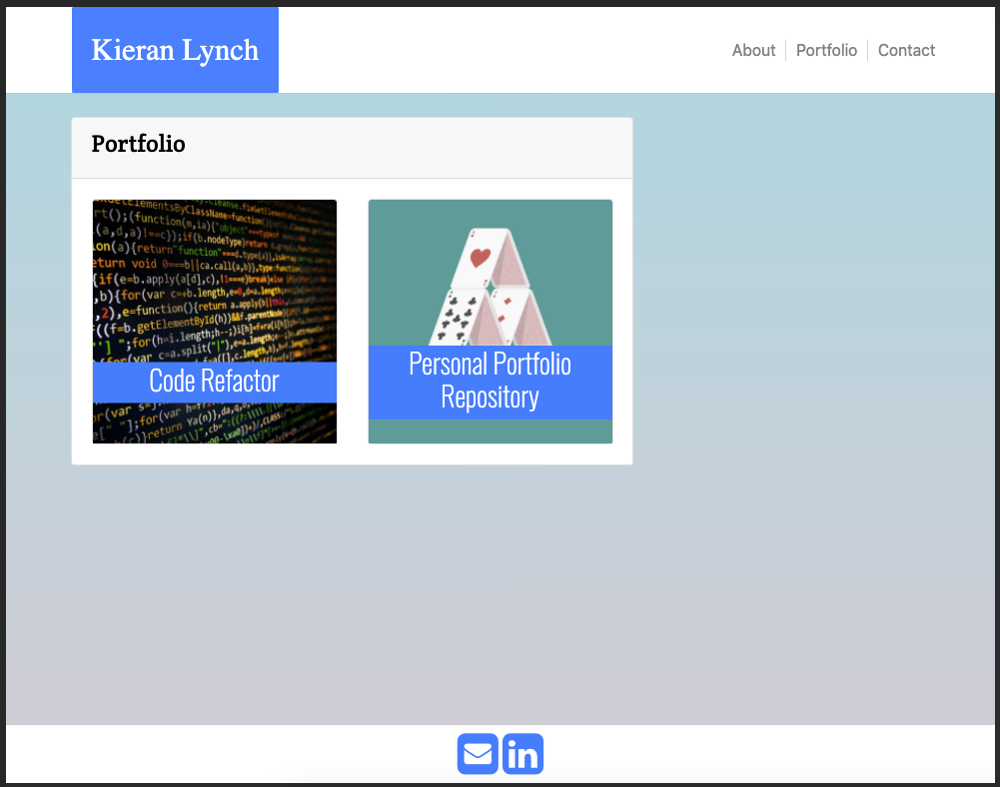
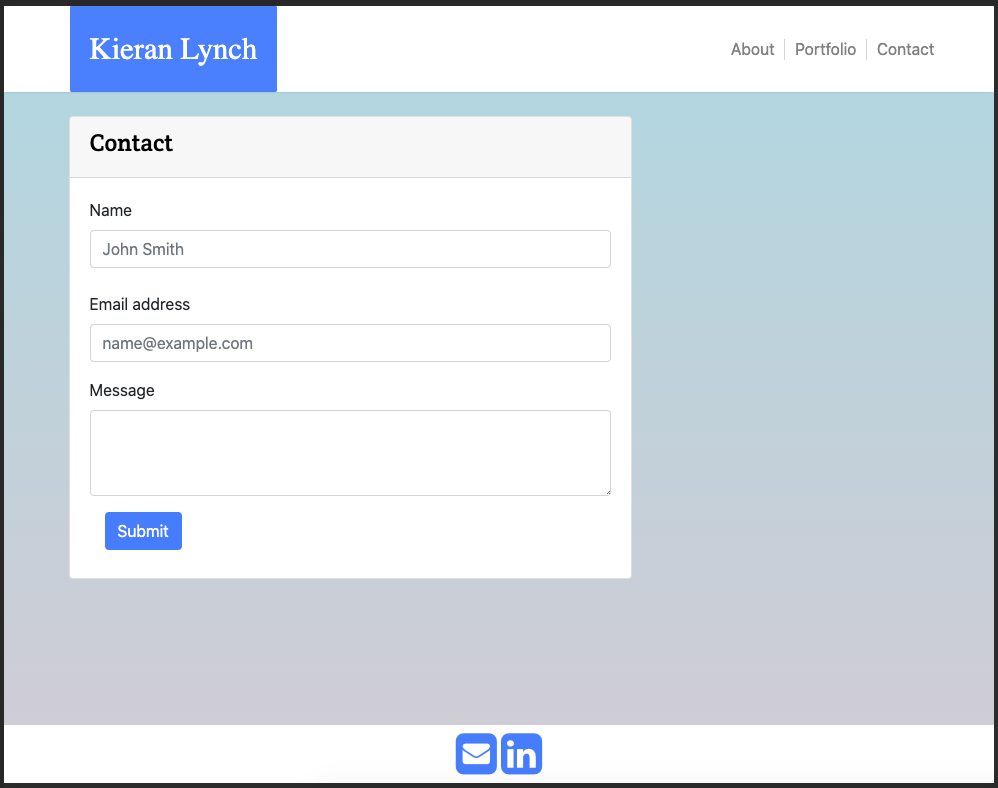
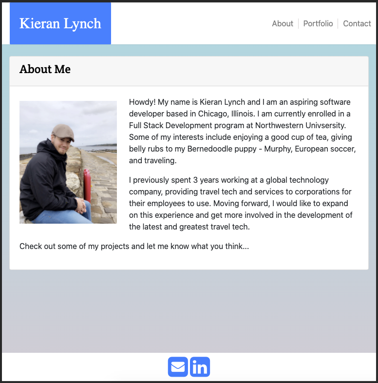
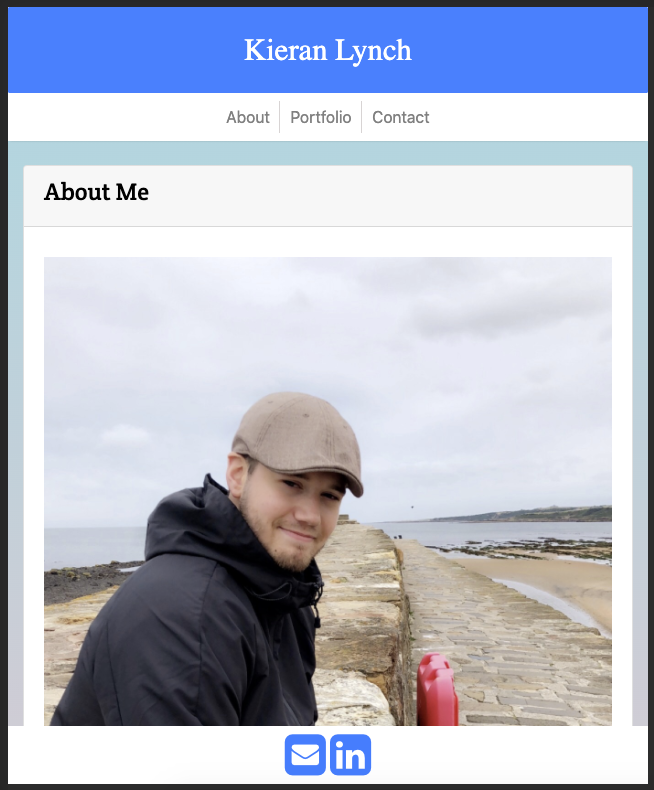

# Homework-2
I created this portfolio website during my time at Northwestern Full Stack Coding Bootcamp. The assignment was as follows:

Using Bootstrap, develop your portfolio site with the following items:

A navbar

A responsive layout

Responsive images

The Bootstrap portfolio should minimize the use of media queries

I started by creating 3 basic webpages - About Me, Portfolio, and Contact. I created a consistent and responsive Navbar and added additional CSS styling to make it my own. I also added a gradient for the body because it is more of my own style. 

Here are the 3 pages:

About Me

Portfolio

Contact

Below are 3 images that demonstrate the responsiveness of the website:
<<<<<<< HEAD

=======

>>>>>>> 5c4c3e72e99d304388b8e5664dddc820f567231f

Link to deployed application: https://klynch94.github.io/Personal-Portfolio/
